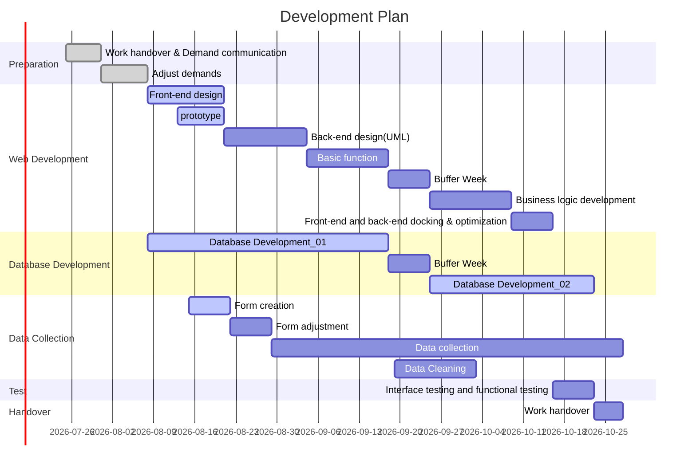

### **Inner Intel (Web)**

   

---

> Web application for nutritionists

#### 01_Development background

The S.A.Y. team has developed Inner Intel, a Java-based app for Android.
After understanding the needs of nutritionists, the team decided to continue to develop an Inner Intel web-based application that would meet the needs of nutritionists to Contact and guide general users in dietetics.

---

#### 02_Technical selection

1. **System environment**
   - Windows
   - (Browser version limit)

2. **Main framework**
   - (if any)

---

#### 03_Main Features.

- Shared database with the Inner Intel java side serving regular users.
- There is a complete permission management system.
- There is a comprehensive privacy protection policy.

---

#### 04_Main Functions

- Allows visual viewing of user-specific data.
- The java side of the specified user can be set up by nutritionists.
- nutritionists can view the system's analysis of the specified user's data.
- nutritionists can upload data analysis reports from nutritionists.

---

#### 05_API

(If any)

---

#### 06_Development Plan

---

#### 07_Group S.A.Y. Team Members

| Name        | title                         | Email               |
| ----------- | ----------------------------- | ------------------- |
| Shuyi Chen  | Spokesperson, Project Manager | u7175274@anu.edu.au |
| Yuhao Zhai  | Spokesperson, Project Manager | u7152566@anu.edu.au |
| Xinyue Hu   | Database Manager              | u7151386@anu.edu.au |
| Hengtong Wu | Database Engineer             | u7235221@anu.edu.au |
| Tianqi Tang | Techinical Lead               | u7192230@anu.edu.au |
| Shiyun Zhu  | Web Developer                 | u7041419@anu.edu.au |
| Siyuan He   | Web Developer                 | u7344524@anu.edu.au |

---

#### 08_License

None

---

#### 
